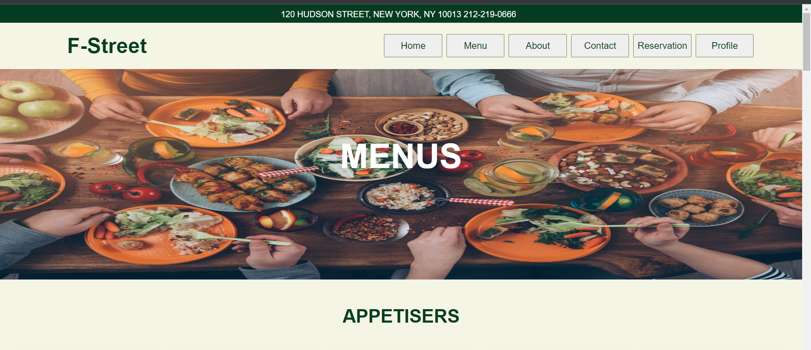
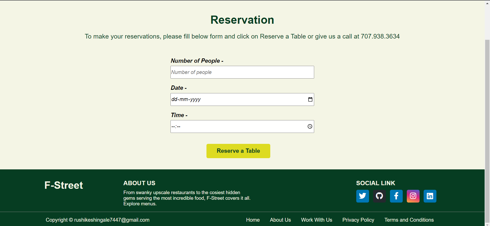

# Restaurant Website Project Documentation

# Introduction -: 
- Welcome to our restaurant website project, a delightful online platform designed to showcase our restaurant's offerings, streamline reservations, and provide an immersive glimpse into our culinary world. This project marries technology with the art of gastronomy, offering a seamless and engaging experience for our customers and potential visitors.

# Project Overview -: 
- Your restaurant website project is designed to provide an engaging online experience for users to explore the restaurant's offerings, make reservations, and learn more about the establishment.

# Purpose and Scope
- The purpose of this project is to create a fully functional restaurant website that covers essential features like menu display, reservations, user authentication, and responsive design.

# Technologies Used
- List the technologies and tools used in the project, such as HTML, CSS, JavaScript, etc.

<h3>1. Home Page -: <h3>
    

<h3>2. Menu Page -:</h3> 
    

<h3>3. About Page -:</h3>
 

<h3>4. Contact Page -:</h3>
 

<h3>5. Reservation Page -:</h3> 

<h3>6. Profile Page -: </h3>

<h3>7. Log-in Form -:</h3>

<h3>8. Reservation Form -: </h3>

# Live Link -: 
<a href="https://mrrushikesh.github.io/Rushikesh_Ingale_DOM_final_17th_Sep_2023/Pages/profile.html">Click Here</a>
